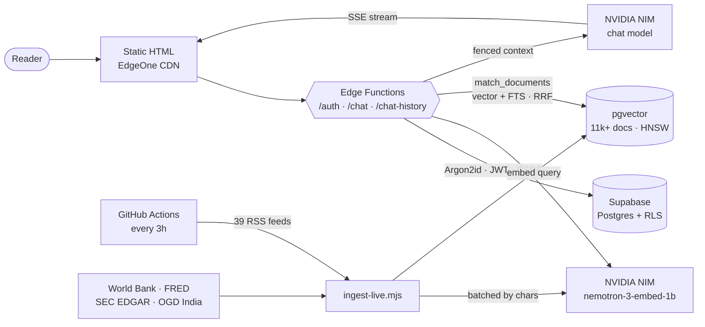

<p align="center">
  <a href="https://econintel.edgeone.app">
    
  </a>
</p>

<p align="center">
  
</p>

<p align="center">
  <a href="https://econintel.edgeone.app"></a>
  
  
  <a href="LICENSE"></a>
</p>

<p align="center">
  
  
  
  
  
  
  
  
</p>

---

## What this is

An economics and geopolitics chat that answers with **causal mechanism and a
historical analogue**, grounded in sources it actually retrieved — central banks,
statistical agencies, open research — and refuses to invent a number when the
library comes back empty.

It is not a news aggregator and not a stock tipster. Every answer follows
**ARVC**: assertion, reason, value, case study.

> **Try it:** [econintel.edgeone.app](https://econintel.edgeone.app) — 5 questions
> free, no signup, no card.

The interesting part for anyone reading the code is the constraint: **no build
step, no runtime dependencies, no framework.** Static HTML and a handful of edge
functions, deployed by `git push`. Every problem below is solved without a
package.

---

## Architecture



Retrieved text never reaches the model as instructions. Each block is wrapped in
a **per-request random nonce** and labelled untrusted data, and the nonce is
stripped from the content so a poisoned feed cannot forge a fence and break out.

---

## Numbers

| | |
|---|---|
| Corpus | **11,000+** documents and growing — the ingester runs every 3 h |
| Retrieval | **~43 ms** warm, against a 3 s statement timeout |
| Retrieval quality | **92%** of golden queries hit inside top-6 (bar: 70%) |
| Sources polled | **39** RSS feeds every 3 h + 4 open-data APIs daily |
| Runtime dependencies | **0** |
| Uptime checks | every **30 min**, no LLM cost |

---

## Things that were harder than they look

**Hybrid retrieval.** Pure vector search could not separate the crisis case
studies — they all share *IMF, inflation, currency, crisis*. The terms that
separate them are exact entities: *Volcker*, *1997*, *peg*. So `match_documents`
runs a vector leg and a full-text leg and fuses them with **Reciprocal Rank
Fusion**, with one relevance floor applied *after* fusion so it covers keyword-only
hits too.

**A 2048-dim vector index.** pgvector's HNSW caps at 2000 dimensions and this
model emits 2048. The index is built on the **cast** — `(embedding::halfvec(2048))`
— which indexes to 4000. Before it existed, the sequential scan hit 7.4 s against
anon's 3 s timeout, retrieval returned nothing, and the chat kept answering
ungrounded because `retrieveContext` fails open. Nothing was red for a month.

**Embedding-space drift.** Changing the embedding model silently stranded 29% of
the corpus in a dead coordinate space — vectors from two models score ~0.00
against each other. Every row now records `embedding_model` *and* `embedded_at`,
because the label alone turned out to be destroyable by a careless backfill. A
date is not.

**Batching by characters, not count.** A fixed batch size of 25 worked until
arXiv and NBER joined the feed list with 2,000-character abstracts, which pushed
a single request past the model's context window. Batches are now sized by total
characters, so long abstracts split automatically.

---

## Security

Full policy and disclosure process: **[SECURITY.md](SECURITY.md)**

| | |
|---|---|
| Passwords | Argon2id (`m=19456, t=2, p=1`), vendored WASM, no network fetch |
| Sessions | 15-min access JWT, 30-day rotating refresh, HttpOnly + `SameSite=Strict` |
| CSRF | double-submit **+** server-issuance check **+** bound to the user |
| Revocation | `token_version` checked on every verify, **fails closed** on DB error |
| Database | RLS on all four tables with **no policies** — the publishable key can do nothing |
| Rate limits | per-IP guest quota, per-account daily, per-minute burst, per-IP free tier |
| Prompt injection | per-request nonce fence around all retrieved content |
| Privacy | account deletion cascades; full data export as JSON |

Known-open items are listed in SECURITY.md rather than hidden — including the
response headers EdgeOne will not let this repo set, and why the landing page
needs `'unsafe-eval'` that the authenticated page does not get.

---

## Repo layout

```
functions/          edge functions — auth, chat, chat-history, shared middleware
  argon2.js         vendored hash-wasm (MIT), base64-embedded WASM
*.html              one file per page, inline CSS + JS, no bundler
.rag/               ingestion, retrieval schema, golden eval set, source catalog
.migrations/        numbered SQL, each with a matching rollback
.scripts/           stdlib-only self-checks + live smoke test
.github/workflows/  ingest · heartbeat · smoke · retrieval quality · feed health
```

**Why the dots?** EdgeOne Pages serves every non-dot file in the repo root as a
public static asset. Dot-prefixing is the only mechanism that keeps the pipeline,
migrations and scripts off the public site. It is load-bearing, not cosmetic —
that is also why the manifest is `.package.json`.

---

## Running it

There is nothing to install and nothing to build.

```bash
git clone https://github.com/Anshk2009/Econintel && cd Econintel
python -m http.server 5601        # any static server will do
```

Pages render immediately. The edge functions do **not** run locally — nothing in
this repo can serve `functions/` — so auth and chat will 404, which is the honest
answer when no backend is running. `.env.example` lists every variable the
deployed functions expect; none of them are needed to read or style the site.

```bash
node .scripts/test-*.mjs                 # self-checks, no network, no secrets
node .rag/ingest-live.mjs --dry-run      # exercise the whole pipeline, spend nothing
BASE_URL=http://localhost:5601 node .scripts/smoke.mjs --cheap
```

---

## Deploying

EdgeOne Pages is linked to `main` and auto-deploys on push — **a push is the
deploy.** Environment variables live in the EdgeOne dashboard, never in the repo.

Two things the repo cannot do for you:

1. **Response headers.** HSTS, `nosniff` and `X-Frame-Options` need a dashboard
   rule on `/*`; a `<meta>` CSP cannot set them. The daily smoke test prints a
   non-failing advisory until they land.
2. **Backups.** Nothing here backs up `users` or `chat_history`. Check what your
   Supabase plan retains before any migration that touches them.

---

## Open

Honest list, roughly by value:

- [ ] Response headers via the EdgeOne dashboard
- [ ] Password-reset email — token works; Resend is still on the test sender
- [ ] Email verification — endpoint exists, no mail is ever sent
- [ ] Payments — Stripe is unavailable in India; Razorpay/Paddle unexplored
- [ ] Legal placeholders — registered address and Grievance Officer details

---

## Licence

[MIT](LICENSE). Retrieved RSS and open-data material is **not** covered and stays
with its publishers — see `.rag/sources-catalog.md` for attribution and the
republishing rules the pipeline enforces.

<p align="center">
  <sub>Built by <a href="https://github.com/Anshk2009">Ansh Kashyap</a> · alongside Grade 11 and JEE prep</sub>
</p>
